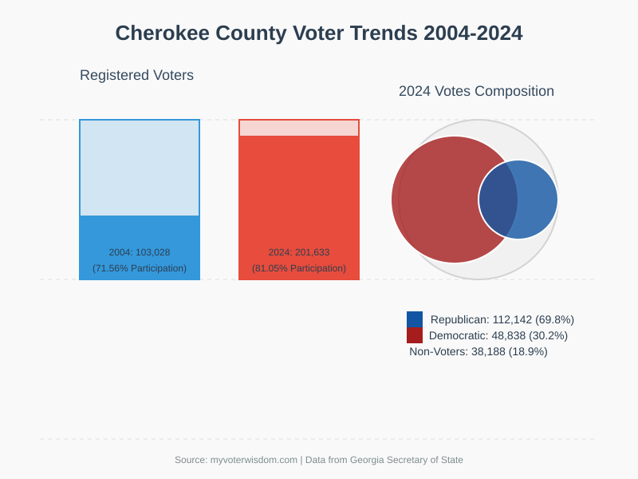

# Election Prediction System

This project is an election prediction system that utilizes machine learning models to predict election outcomes based on county data.

## Features

- Predict election outcomes based on historical county data.
- Visualize voter trends using SVG charts.
- AI-powered simulated question-answering for election-related queries.
- Supports adding new counties and states dynamically.

## Project Structure

```
election-prediction-system
├── src
│   ├── main.py                # Entry point of the application
│   ├── data
│   │   └── counties.json      # Data for the counties involved in the election
│   ├── models
│   │   └── prediction_model.py # Defines the prediction model
│   ├── utils
│   │   └── data_processing.py  # Utility functions for data processing
├── requirements.txt           # Project dependencies
└── README.md                  # Documentation for the project
```

## Setup Instructions

1. Clone the repository:
   ```
   git clone <repository-url>
   ```
2. Navigate to the project directory:
   ```
   cd election-prediction-system
   ```
3. Install the required dependencies:
   ```
   pip install -r requirements.txt
   ```

## Usage Guidelines

To run the election prediction system, execute the following command:
```
python src/main.py
```

This will initialize the system, load the county data, and start the prediction process.

## Contribution

Contributions are welcome! Please submit a pull request or open an issue for any enhancements or bug fixes.

## Runbook
    1. Data/voting_pres_data.csv will need to be updated with new county records as more are added 
    2. To get predictions on the county you will need to run 
        a. From route
        b. Python app.py
            i. Results.json will have the results of the model if only one element the you will not get a model just 100 accuracy message.
    3. If new county added you will need to run 
        a. Python getStateCounty.py
        b. This will build the county.json & state.json 
        c. You will need to run main_all_county.py to get 
    4. *anything with simulate is for AI to use to learn about the prompt response for AI

## License

This project is licensed under the BSD 3-Clause License. See the LICENSE file for details.

## Screenshots

### Voter Trends Visualization
